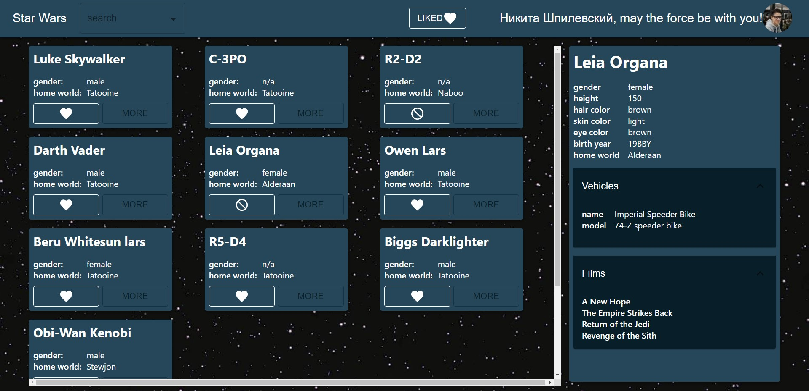
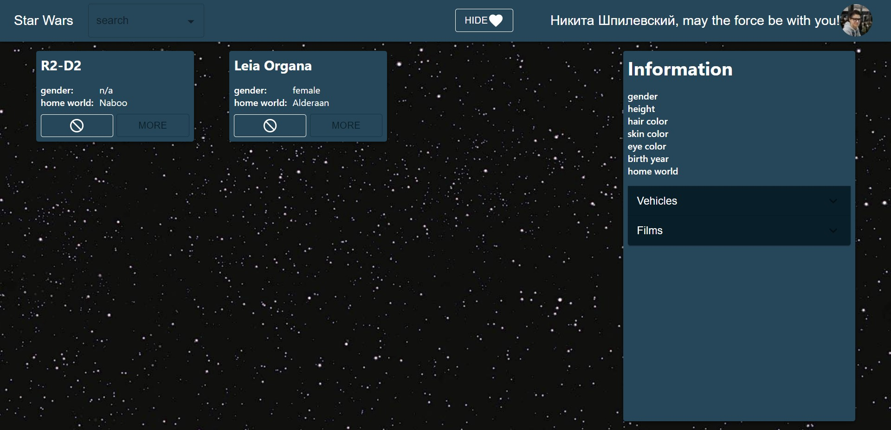
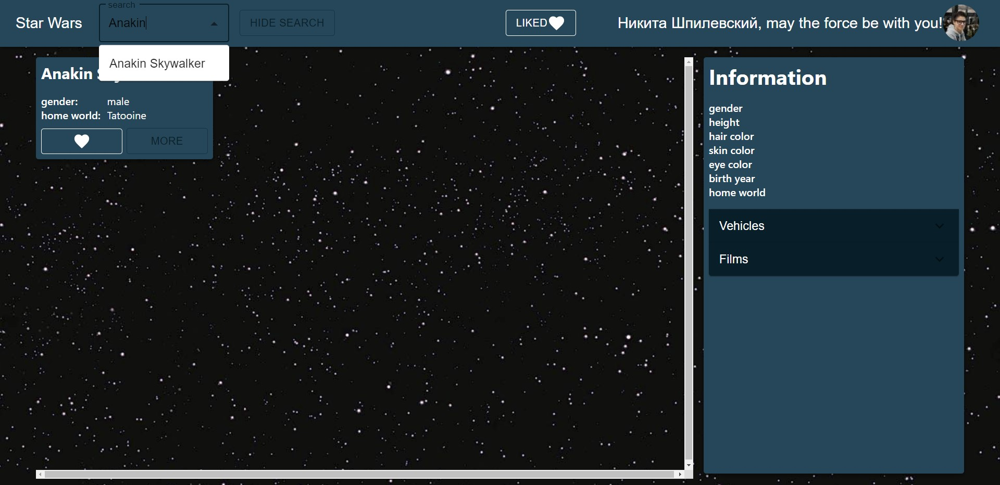

# SWAPI-React-Hooks

This project is made using React, React Hooks, Material UI and [SWAPI](https://swapi.dev/).
Project constains Sign in with Facebook, Lazy load and autocomplete.

# Usage
1. npm i
2. npm run build
3. npm start

# Demo

